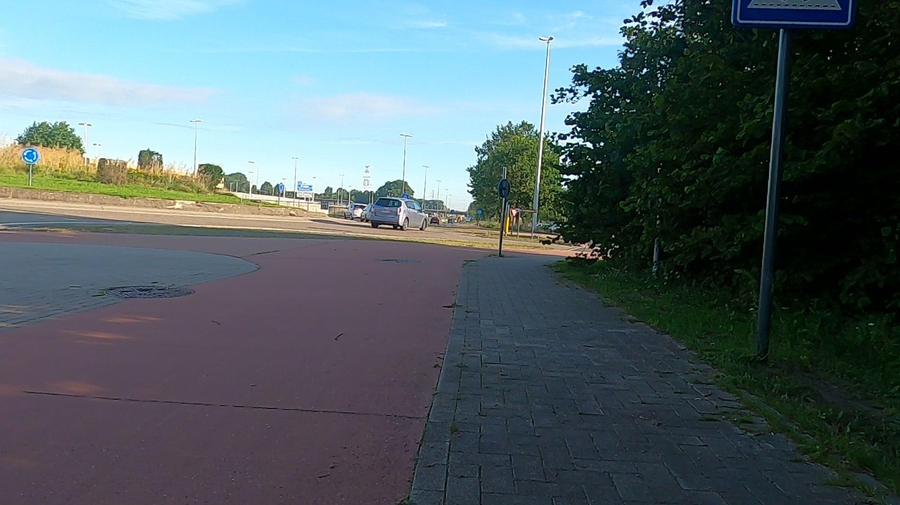
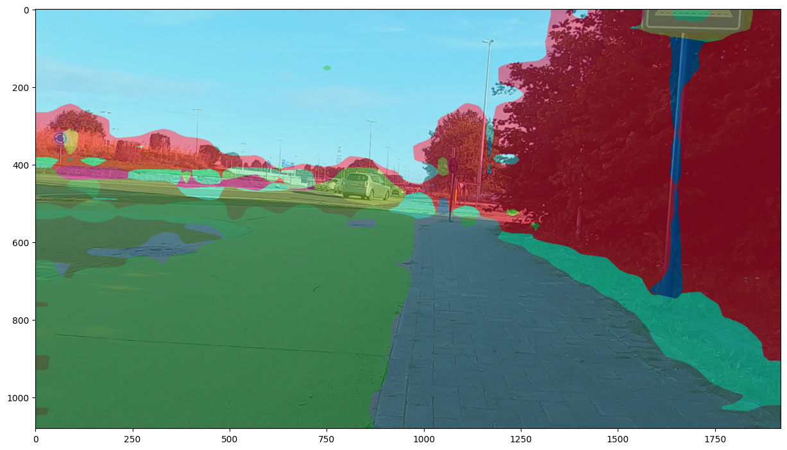

# DinoVision: Semantic Segmentation for Urban Safety

## Project Overview
DinoVision is an advanced semantic segmentation implementation utilizing Facebook's DINOv2 transformer architecture to create pixel-precise classifications of urban environments. The model identifies and segments 34 distinct urban elements including sidewalks, roads, crosswalks, and other critical infrastructure to enhance safety analysis and urban planning.

## Technical Details

### Model Architecture
- **Backbone**: Facebook's DINOv2-base transformer (frozen during training)
- **Segmentation Head**: Custom LinearClassifier with 1×1 convolutional layers
- **Output Resolution**: Bilinear interpolation to maintain original image dimensions
- **Implementation Framework**: Hugging Face Transformers + PyTorch

### Dataset
- **Source**: Segments/Sidewalk-Semantic dataset
- **Classes**: 34 distinct urban elements (roads, sidewalks, vehicles, etc.)
- **Split**: 80% training, 20% testing
- **Preprocessing**: 
  - Normalization with ADE mean/std values: `[123.675, 116.280, 103.530]/255`, `[58.395, 57.120, 57.375]/255`
  - Resize to 448×448 pixels
  - Horizontal flipping (50% probability during training)

### Training Pipeline
- **Batch Size**: 4
- **Optimizer**: AdamW with learning rate 5e-5
- **Loss Function**: CrossEntropyLoss with background class ignored (index 0)
- **Training Duration**: 10 epochs
- **Evaluation Metrics**: Mean IoU and Mean Accuracy computed every 50 batches
- **Data Handling**: Custom SegmentationDataset class with specialized collate function

### Visualization
- **Technique**: Random color mapping for each semantic class
- **Overlay Method**: Blending original image (50%) with colorized segmentation map (50%)
- **Display**: Matplotlib for visualization with configurable figure size

## Implementation Highlights

### Custom Components
- **SegmentationDataset**: Extends PyTorch Dataset for efficient data loading and transformation
- **Dinov2ForSemanticSegmentation**: Custom model extending Dinov2PreTrainedModel for semantic segmentation
- **LinearClassifier**: Specialized classifier for processing patch embeddings into segmentation maps

### Transfer Learning Approach
- Pre-trained DINOv2 weights frozen to leverage learned visual representations
- Only the segmentation head trained, significantly reducing compute requirements
- Efficient fine-tuning while maintaining powerful feature extraction capabilities

### Performance Evaluation
- Progressive tracking of mean IoU and mean accuracy during training
- Visualization of predictions on test images for qualitative assessment
- Ability to handle unseen urban scenes with robust segmentation performance

## Applications
- Urban planning and safety analysis
- Autonomous navigation in complex urban environments
- Accessibility assessment for pedestrian pathways
- Traffic management and infrastructure development

## Future Work
- Integration with video processing for real-time segmentation
- Extension to additional urban datasets for improved generalization
- Exploration of ensemble approaches combining DINOv2 with other architectures
- Deployment optimizations for edge devices in smart city applications
